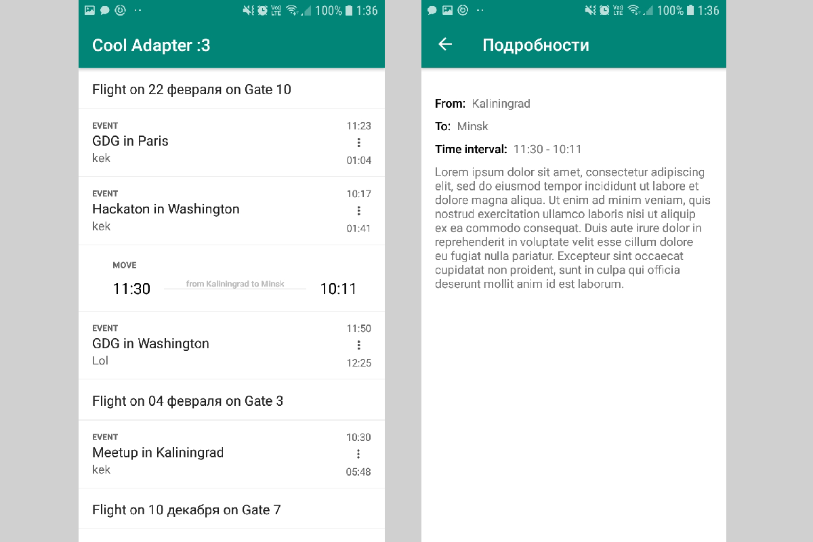

# Cool Adapter

Приложение, отображающее список некоторых элементов. При тапе по элементу, открывается новый экран с отображением подробной информации об элементе.

Список формируется случайным способом из объектов трех типов: `Event`, `Move`, `Notice`



## Как добавить новый элемент

1. Создать POJO\Data class и аннотировать его `@BindItem`

```kotlin
@BindItem(EventItem::class)
class Event (
    var startTime: Date? = null,
    var endTime: Date? = null,
    var name: String? = null
)
```

1. Создать Item для вашего POJO\Data class. Здесь наследники BaseItem выполняют роль провайдера данных из модели к `ViewHolder`. Каждому типу "плиточки" в `RecyclerView` нужна своя реализация `BaseItem`.

```kotlin
class EventItem(val event: Event) : BaseClickableItem<EventItem.ViewHolder>() {

    override fun updateViewHolder(viewHolder: ViewHolder) {
        viewHolder.title.text = event.name
        viewHolder.startTime.text = ... // update view holder
        viewHolder.endTime.text = ... // update view holder
    }

    // Nested view holder class for each Item type
    class ViewHolder(itemView: View) : BaseViewHolder(itemView) {
        val title by bind<TextView>(R.id.textViewCoupleName)
        val startTime by bind<TextView>(R.id.textViewCoupleTimeStart)
        val endTime by bind<TextView>(R.id.textViewCoupleTimeEnd)
        val description by bind<TextView>(R.id.textViewCouplePlace)
        override fun onCreateView(view: View) = Unit
    }

    // boilerplate
    override fun approveFactory(factory: BaseFactory) = factory is Factory

    // item_couple_min_layout is a layout 
    // of your item for recyclerview
    class Factory : BaseFactory(R.layout.item_couple_min_layout) {
        override fun instance(view: View): BaseViewHolder = ViewHolder(view)
    }
}
```

3. Создать адаптер и зарегистрировать типы данных, которые вы будете выводить в `RecyclerView`.

```kotlin
val adapter = BaseAdapter.Builder()
        .registerViewTypeFactory(Event::class)
        .registerViewTypeFactory(Move::class)
        .registerViewTypeFactory(Notice::class)
        .build()
```

4. Для автоматического создания объекта BaseItem (и последующего добавления в адаптер RecyclerView) можно использовать метод `adapter.generateItem(any)`

Для того чтобы можно было отлавливать нажатия на элементы, нужно наследовать их `Item` от `BaseClickableItem` и в `ListPresenter` ловить событие нажатия в методе `onItemSelect`.